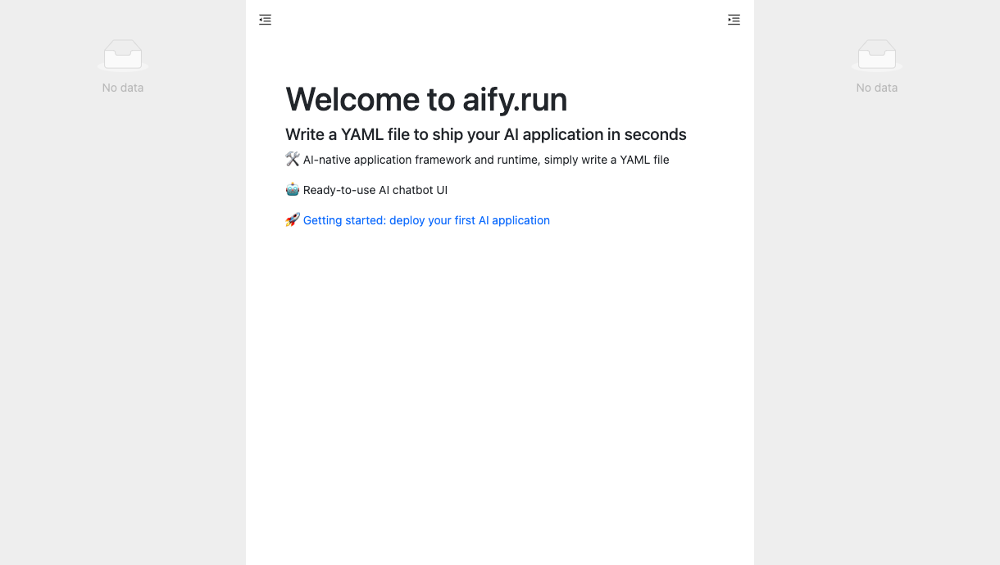
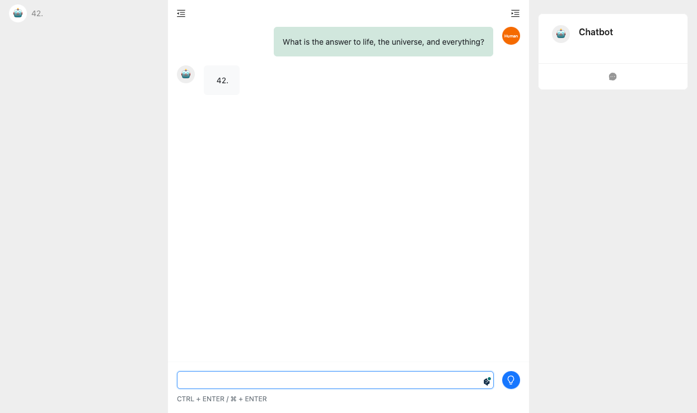

# Getting started

Welcome to Aify, the AI-native application framework and runtime that allows you to ship your AI applications in seconds! With Aify, you can easily build and deploy AI-powered applications using a simple YAML file. In this guide, we will walk you through the steps to get started with Aify and create your first AI application.


## Installation

To begin, make sure you have the following prerequisites installed on your system:

* Python 3.8 or higher
* Pip package manager

Once you have the prerequisites, you can install Aify by running the following command in your terminal:

```bash
pip install aify
```

## Create your fist app

You need to prepare a directory for your applications:

```bash
mkdir ./apps
```

Now you can start the aify service and then access [http://localhost:2000](http://localhost:2000) using a browser, and aify will greet you.

```bash
aify run ./apps
```



Now it's just a blank application, you can't use it for anything. Next, we will create a chatbot.

Creating a YAML file aify uses a YAML file to define your AI application. This file contains all the necessary configurations and settings for your application. Here's an example of a basic YAML file:

```yaml
title: Chatbot

model:
  vendor: openai
  name: gpt-3.5-turbo
  params:
    api_key: <YOUR_OPENAI_API_KEY>

prompt: |
  {{#system~}}
  You are a helpful and terse assistant.
  {{~/system}}

  {{#each (memory.read program_name session_id n=3)}}
  {{~#if this.role == 'user'}}
  {{#user~}}
  {{this.content}}
  {{~/user}}
  {{/if~}}
  {{~#if this.role == 'assistant'}}
  {{#assistant~}}
  {{this.content}}
  {{~/assistant}}
  {{/if~}}
  {{~/each}}

  {{#user~}}
  {{prompt}}
  {{memory.save program_name session_id 'user' prompt}}
  {{~/user}}

  {{#assistant~}}
  {{gen 'answer' temperature=0 max_tokens=2000}}
  {{memory.save program_name session_id 'assistant' answer}}
  {{~/assistant}}

variables:
  - name: prompt
    type: input
  - name: answer
    type: output
```

Here are some simple explanations about this YAML file:

* The ***title*** represents the name of this application.
* The ***model*** section defines the AI model used by this application and the runtime parameters required by the model.
* The ***prompt*** section is used to drive the application's execution. Aify uses the guidance software package provided by Microsoft to drive the execution of the AI program. Guidance provides a way to operate as a Chain of Thought. Since guidance uses the Handlebars template system, the format of this section is actually a Handlebars template.The prompt section contains some helper functions that allow the AI model to dynamically change its runtime behavior, helping us achieve more complex functionality. These functions are built-in to aify, but you can also write your own helper functions in Python to accomplish specific tasks.
    * The terms "system," "user," and "assistant" are used to define the roles in an LLM-based chat task.
    * "memory.read" and "memory.write" are built-in helper functions in Aify, used to save and load the conversation history of users and AI.
    * "each" and "if" are branch control statements provided by Handlebars.
    * "gen" is the function provided by "guidance" to indicate the execution of LLM generation tasks.
* The ***variables*** section defines the input and output variables of the application, which are used for external systems to access the data generated by AI through an API.

## Play with your AI app

Now go back to your browser and refresh the page. You will see the application you just created. You can have some conversations with it, just like ChatGPT.



## aify is not a chatbot

Although aify provides a chatbot interface, its main purpose is not to provide a replacement for ChatGPT or a competitive conversation application.

The chatbot UI is only for convenient debugging of AI applications. Of course, you can indeed use it as a chatbot for daily use.

The main goal of aify is to provide an efficient framework for developing and deploying AI applications.

If your goal is to develop your own complex AI applications, you should pay more attention to the APIs and extension mechanisms provided by aify.